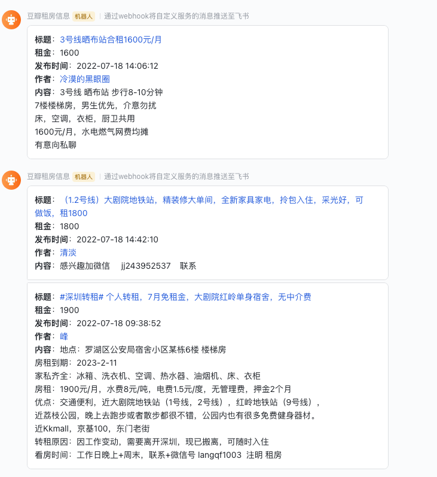

# 豆瓣租房小组监控

## 简介

### 背景

豆瓣小组上的租房信息太过混乱，查看起来很浪费时间，可能找半天也找不到自己想要的房源信息，同时豆瓣自带的搜索功能很不好用，按关键词搜出来的帖子都是已经发布了好几天的，最近发布的内容搜不出来，并且搜索的结果还不全。而这些较老的帖子，大部分基本都已经租出去了，就算没租出去，那也是性价比较低的（挂了好多天都没租出去，说明没多少人感兴趣）

为了能够找出这一大堆帖子中，最新发布，同时又符合自己条件的帖子，就写了这么个脚本，让自己找房子更方便，省去筛选无用数据的时间。

### 项目说明

由于豆瓣的限制，爬取每篇帖子都会随机等待一定时间，以尽量不触发反爬机制，爬取速度比较慢。(也没必要快速爬取，此项目主要是用于监控新发布的帖子，而非做数据聚合统计)，一轮抓取完成后休眠一定时间后再开始下一轮抓取。

当获取到符合条件的帖子时（通过发布时间、租金、关键词等筛选），通过机器人推送消息到指定聊天中，方便自己查看。目前支持飞书、企业微信、钉钉等群聊机器人。

## 使用

> python版本为3.x

```bash
# 克隆项目
git clone https://github.com/iszhouhua/douban-group.git
cd douban-group
# 创建 venv
python -m venv .venv
# 激活
source ./.venv/bin/activate
# 安装依赖
pip install -r requirements.txt
# 修改配置 -> config.py, 然后运行 main.py
python main.py
```

> 项目配置都在config.py中，需先修改后方能使用。

## 截图

### 飞书



### 钉钉


### 企业微信


